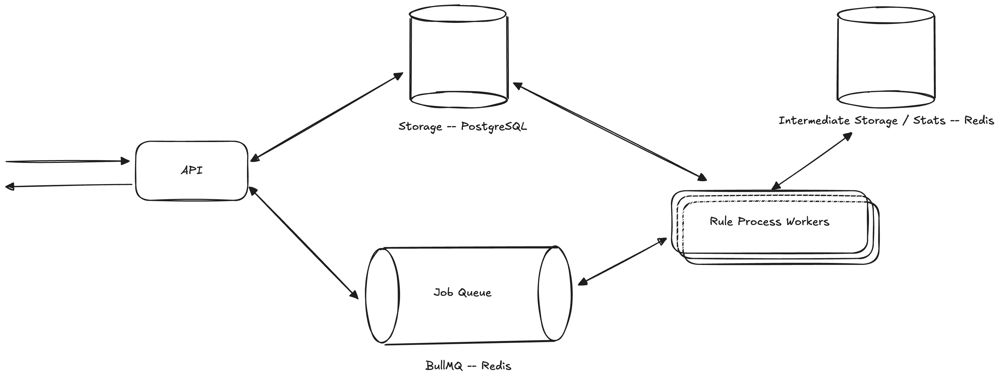

# DotfileTms

## Requirements

⚠️ Make sure you have installed all [requirements](./docs/requirements.md)

```bash
cd dotfile-tms
make -C dev-stack certs-generate
make -C dev-stack add-hosts
make -C dev-stack start
npm install
```

## Running

### Start apps

```bash
nx serve tms-api # start & serve API
nx serve tms-app # start & serve App
```

### Run tests

```bash
nx test tms-api # run unit tests
nx test tms-app # run unit tests
nx e2e tms-api-e2e # run e2e tests
```

### Note on e2e tests

We don't cleanup tests between runs yet, so you'll need to:

- Clear the database with `./tools/scripts/db/schema/drop.sh`
- Clear the redis accounts database by remove the `accounts` key in redis (https://redis.dotfile-tms.local/)
- Trigger the database migrations, for example by editing a file in `tms-api` or restarting the `tms-api` server.

## Notes

### Architecture

I used the dotfile-tms repo and explored the NestJS and GraphQL stack to get up to speed with the team’s stack. I also looked into hexagonal design and DDD approaches.

I used AI to "spike" through nestjs for now to get a scalable architecture down before refactoring to patterns. I focused on getting an architecture that feels nestJS-ish, which means I took a bunch of shortcuts regarding tooling and code.

I focused on figuring out the proper structure for the service, modules, etc. What I’m trying to sell here: “I can get up to speed on the stack and write (knowingly) mediocre code for that stack along the way, but with the right patterns and seams to make it easy to improve.”

### Open questions and assumptions

- Should we check the source & target accounts for every tx or just the source?
  - Assumption: We'll check the source for now.
- What’s the expected shape of accounts & frequencies
  - I imagine a Pareto-style diagram with a few accounts generating A LOT of transactions and a long tail
  - I imagine the “suspicious” accounts will be found everywhere along that diagram
- Are the rules the same for every API client?
  - Assumption: for now, we’ll use hardcoded rules; later, we’ll associate them per client
- Flagging rules like “flag transactions from high-risk jurisdictions or multiple countries within a short time.” What does short time mean here? 30 min? 5 days?
  - Assumption: We have not implemented this rule yet, but it will be easy to implement later with a configuration.
- Can we assume the client uploads transactions in order? For example, can a client upload transactions from last week from another system after the client has sent real-time transactions for today?
  - Assumption: This should be possible; we assume the client might send unordered batches of CSV, for example.

### Bricks

- **Data Model**
  - Transaction
  - Alert
  - Rules
- **API**
  - GraphQL & Rest API
  - Worker & Rule Evaluation
  - (Test code is mostly AI-generate there)
- **Visualisation App**
  - Simple Render with ChakraUI, GraphQL, and React
  - (Code is mostly AI-generated there)

### High-Level Architecture



Super High Level Architecture - CQRS’ish processing


Public API side Decomposition


Rule Evaluation Side Decomposition

### Tools

React, NestJS, React Query / Apollo GraphQL

- Redis
  - The document references BullMQ, which would be a nice way to implement the job queue.
  - Redis would help me implement statistics in the rules. It would be nice to be able to process a bunch of transactions and store stats with a TTL so we don’t have to worry about garbage collection.
- BullMQ
  - The _exactly once_ semantics makes our life easier. The worst-case scenario is that at least once, the condition here needs to be double-checked, but in the worst case, that means we might generate false positives, but not miss positives.

### Scalability / System Design

- We’ll want to scale most of our system horizontally:
  - Rule processing system: Spin up more workers to process more transactions
  - Transaction ingestion: Spin up more API processes.
  - Statistics (Redis), and DB (PostgreSQL)
- We want to store all the transactions reliably. I believe we can partition the database on “account source key” because most transactions, at least in the project's first steps, will be local to the account.
- Concurrency / Consistency
  - We’ll have to process multiple transactions for the same account without race conditions ⇒ Redis atomic operations will be used here. Alerts are linked per transaction.
  - We’re leaning towards using two systems to achieve reliability in tx storage and scalability in alert processing, which means an issue with consistency—we’ll have to be extra careful to detect transactions that didn’t make it to the queue.
- Constraints
  - I assume workers will be mostly IO-bound at first, but later on, as we use more complex rules (ML, for example), we could use the BullMQ flows to create a flow of operations, with some operations running on dedicated workers with their own scaling rates.
- Model Updates & Hotfixes
  - I’d like to investigate the idea of having versioned account history tables if needed, and using [_lenses-style_](https://www.inkandswitch.com/cambria/) stats definition to convert data from v1 to v2 at runtime
  - We’ll need a way to define new rules and systems to revisit previous transactions if required. The transaction DB will be our source of truth, like our entry point in the CQRS system. We’d need tooling to run migrations like “reapply all the rules to the transaction of the past year,” for example.
- Later
  - Measuring Performance, Elasticity, Logging, Errors

## Steps

### 1. ✅ Go feature complete on the whole flow

- Implement the API entry points
- Data storage in PostgreSQL
- Processing is synchronous and naive; the goal is to learn about the flow and the rule system.
- Implement the UI


Simple UI Mockup

### 2. Scalability

- Go async and scalable
  - ⚠️ Not done yet, but we do have two modules with the transaction queue service used to communicate between them.
  - Split the API into a worker and an API process
  - Use a Message Queue
- Implement a way to make the API synchronous again through a special API / Flag

### 3. Bonus

- Add batch processing
  - I imagine way to ingest CSV would be great, one way to batch processing could be:
    1. The user uploads the file to the API (or a shared FTP server for example)
    2. We generate a “batch ID” and add all the transactions with the batch ID field set
    3. We add a SINGLE create transaction operation in the queue
    4. On the worker side, we’d query the transactions with the given batch ID

### 3. Follow-up

- Implement rate limits / invoicing-related features
- Migrate out of scripty? Appears to be [deprecated](https://www.npmjs.com/package/scripty)
- Make all operations idempotent / retryable - start by creating tests

### Knowingly wrong idioms

Logging a few tasks, as taking the time to get up to speed with nestjs meant giving up on a few idioms:

- [ ] Move configuration for redis to an external config, and use a keyPrefix, which we can override during e2e tests
- [ ] Move the server's URL to an external config in the frontend
- [ ] Remove overly permissive CORS settings and dig into the traefik config
- [ ] Setup tooling to use camelCase in typescript and snake_case in db and I/Os like APIs (use class-transforms?)
- [ ] Setup a way to spin up a test db during e2e tests to avoid using the dev db or rework the test so they don't step on each other toes.
- [ ] Exposing the metadata fields in the graphql schema -- we'd need to discuss the possible values and implement the resolvers for them. Likely a map key => number, string, date.
- [ ] Improve types sharing (see graphql e2e tests, and most other tests)
  - Fix the GraphQL schema generation, I experienced an infinite loop at the time of testing which was supposed to be fixed in la
  - test versions.
  - Related: https://docs.nestjs.com/graphql/sharing-models
  - Realted: https://www.apollographql.com/docs/react/development-testing/static-typing
- [ ] Rewrite tests to use supertest instead of axios, as seems to be the standard in the nestjs community
- [ ] Use the `@nestjs/config` package to load environment variables and configuration files
- [ ] Look into the `CQRS` module in nestjs, as there are well known recipes in the docs.
